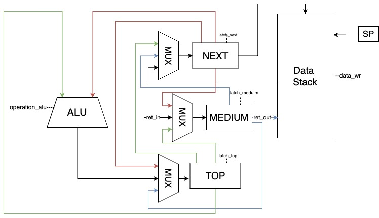
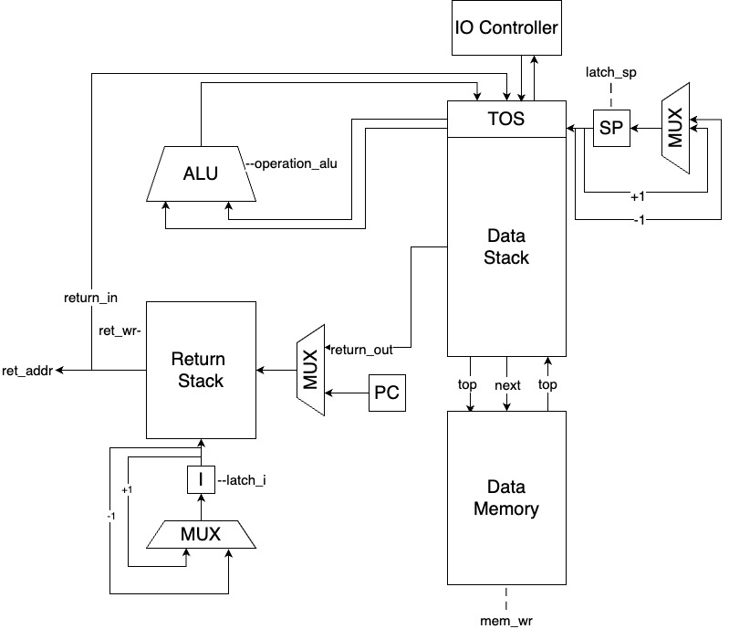
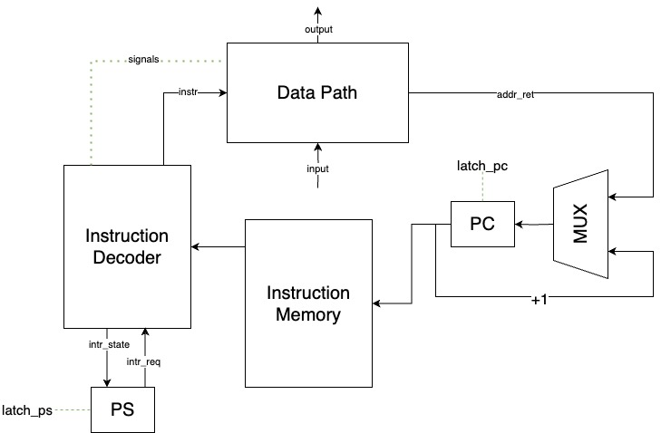

# Лабораторная работа №3. Транслятор и модель процессора

* P3230. Шевченко Дарья Павловна
* ```forth | stack | harv | hw | tick | struct | trap | port | pstr | prob1```
* Базовый вариант

## Язык программирования

```text

<procedure> →  ": " <procedure name> <program> " ;"

<program> →   <empty> | <word> | <program> " " <program> | <conditional operator> |
              <do loop operator> | <begin until operator> <variable declaration>

<variable declaration> → "variable " <variable> | "allot " <integer literal>

<conditional operator> → if <program> [else <program>] then  

<do loop operator> → do <program> loop  

<begin until operator> → begin <program> until  

<word> →   <integer literal> | <mathematical operator> | <string display> | <procedure name> |
            "mod" | "drop" | "swap" | "over" | "dup" | "read" | "emit" | <variable> | "@" 
            | "!" | "ei" | "di" | "or" 

<mathematical operator> → "+" | "-" | "/" | "=" | ">" 

<string display> → "." <string literal>

```

Код выполняется последовательно, кроме процедур

Вызов процедуры осуществляется по имени

Комментарии в программе отсутствуют

Стековые операции (состояние стека до >> состояние стека после)

* ```-``` - (n1 n2 >> n1 - n2)
* ```+``` - (n1 n2 >> n1 + n2)
* ```/``` - (n1 n2 >> n1 / n2)
* ```=``` - (n1 n2 >> n3) 1 если равны, 0 если нет
* ```>``` - (n1 n2 >> n3) 1 если n1 > n2, 0 если нет
* ```or``` - (n1 n2 >> n1 | n2)
* ```drop``` - (n1 n2 >> n1)
* ```mod``` - (n1 n2 >> n1 mod n2)
* ```over``` - (n1 n2 >> n1 n2 n1)
* ```swap``` - (n1 n2 >> n2 n1)
* ```dup``` - (n1 >> n1 n1)
* ```key``` - (n1 >> n2) - ввод c порта n1
* ```emit``` - (n1 n2 >> ) - вывести ASCII символ с кодом n1 в IO порт n2
* ```read``` - (n1 >> n2) - прочитать значение с порта n1 и положить на стек
* ```!``` - (n1 n2 >> ) - сохраняет n1 по адресу n2 в памяти
* ```@``` - (n1 >> n2) - прочитать значение из ячейки памяти n1 и положить на стек
* ```ei``` - включить прерывания
* ```di``` - отключить прерывания
* ```if``` выполняется в зависимости от истинности значения на вершине стека.
Истинное значение это любое число != 0. Ложное значение 0.
* ```do loop``` выполняет цикл, количество итераций которого определяется двумя значениями на вершине стека (n1 и
  n2). Итерации выполняются от n2 до n1 и в каждой итерации можно использовать переменную i, которая равна n2 плюс номер
  текущей итерации.
* ```begin until``` выполняет цикл, пока на вершине стека не окажется истинное значение (любое число, кроме 0).
  Цикл продолжается до тех пор, пока на вершине стека не будет ложное значение (0).
* ```variable``` выделяет в памяти переменную (взаимодействие с помощью ```! @```), ```allot``` выделяет в памяти
  память для хранения данных с фиксированным размером.

Виды литералов:

* строковые - вид " <строка>", для экранизации текста после ```.```
* целочисленные - являются полноценным словом в программе и нужны для того, чтобы положить конкретное
  значение на вершину стека

## Организация памяти

* Память данных и команд раздельна (harv)
* Размер машинного слова данных 32 бита
* Программа имеет прямой доступ к стеку данных и области памяти, выделенной для переменных
* Размеры памяти для данных и команд фиксируются при запуске программы (в Control Unit)

Прерывания:

* Поддерживается один тип прерывания, обработчик которого находится в памяти команд по адресу 01.

Организация программы:

* Процедуры хранятся в памяти последовательно.
* Команды могут иметь аргументы, содержащие адреса или значения, или быть без аргументов.
* Числовые и строковые литералы записываются в память данных в
  момент исполнения программы, а не при запуске модели с помощью команд с Immediate Value.
  Формирование команд для записи строковых литералов - на этапе трансляции
* Переменные хранятся статически в памяти данных

Стек:

* Используются отдельные устройства для стека данных и стека возврата, которые отделены от памяти
  данных и команд.

Память команд

* адресное пространство от 00 до 10000, с 01 ячейки размещаются interrupt handler, после идут обычные команды

```text

+------------------------------+
| 00       jmp N               |
| 01       interrupt handler   |
|      ...                     |
| N - 1    interrupt handler   |
+------------------------------+
| N        program             |
| N + 1    program             |
|      ...                     |
| 10000    program             |
+------------------------------+
```

Память данных

* идет снизу вверх, адресное пространство от 00 до 10000, от 00 до 511 хранятся строковые литералы,
  остальное выделено для переменных

```text
+-----------------------------+
| 00       string literals    |  
| 01       string literals    |  
|      ...                    |  
| 511      strings literal    |  
+-----------------------------+
| 512      variables          |  
| 513      variables          |  
|      ...                    |  
| 10000    variables          |  
+-----------------------------+

```

## Система команд

### Цикл исполнения команды

1) Выборка инструкции
2) Проверка прерывания
3) Исполнение команды

### Набор инструкций

В таблице написаны все элементы системы команд ([isa.py](isa.py)). К машинным командам, которые не соответствуют слову 
из языка, добавлены комментарии.

| Инструкция | Кол-во тактов | Комментарий                                                                |
|:-----------|:--------------|:---------------------------------------------------------------------------|
| add        | 4             |                                                                            |
| div        | 4             |                                                                            |
| sub        | 4             |                                                                            |
| mod        | 4             |                                                                            |
| or         | 4             |                                                                            |
| eq         | 4             |                                                                            |
| drop       | 2             |                                                                            |
| ls         | 4             |                                                                            |
| swap       | 3             |                                                                            |
| dup        | 2             |                                                                            |
| over       | 4             |                                                                            |
| ei         | 1             | разрешить прерывания                                                       |
| di         | 1             | запретить прерывания                                                       |
| read       | 4             |                                                                            |
| emit       | 4             |                                                                            |
| push imm   | 3             | записать в стек значение imm                                               |
| store      | 4             | память данных из стека                                                     |
| load       | 1             | в стек из памяти данных                                                    |
| pop        | 4             | перенос значения со стека данных в стек возврата                           |
| rpop       | 4             | перенос значения из стека возврата в стек данных                           |
| call addr  | 2             | вызов процедуры по адресу addr                                             |
| jmp addr   | 1             | перейти по адресу addr                                                     |
| zjmp addr  | 2             | перейти по адресу addr, если на вершине стека 0, убирает значение со стека |
| ret        | 2             | выход из процедуры или из прерывания                                       |
| halt       |               | конец программы                                                            |

Выборка инструкции осуществляется в один такт с исполнением инструкции без сохранения информации в промежуточные
регистры

### Кодирование инструкций

* Машинный код сериализуется в список JSON
* Один элемент списка, одна инструкция.
* Инструкции кодируются в формат JSON и имеют вид:

```json
 {
  "index": 25,
  "command": "push",
  "arg": 513
}
```

`index` -- номер в машинном коде, необходим для того, чтобы понимать, куда делается условный переход;
`command` -- строка с кодом операции (тип: `Opcode`);
`arg` -- аргумент инструкции (опционален);

## Транслятор

Интерфейс командной строки `translator.py <input_file> <target_file>`
Реализован в [translator.py](translator.py).

Основные элементы используемые в процессе трансляции:

* слово - исходное слово в тексте программы
* терм - слово программы, преобразованное в формат машинной команды (слово != терм только для литералов)
* машинное слово - машинная команда

Этапы трансляции:

### 1)Трансформирование текста в последовательность термов

Реализуется функцией [translator.py:split_to_terms](translator.py#L24).

### 2)Валидация термов

Программа на языке Forth должна удовлетворять условиям

* терму `DO` должен соответствовать терм `LOOP`
* терму `BEGIN` должен соответствовать терм `UNTIL`
* терму `IF` должен соответствовать терм `THEN`, между ними может быть терм `ELSE`
* терму `:` должен соответствовать терм `;`
* терму `:intr` должен соответствовать терм `;`
* объявление переменной должно иметь вид `variable <name> [allot <int>]`

На данном этапе проводится валидация термов, оповещение пользователя в случае проваленной трансляции с указанием ошибки
и номера слова, в котором ошибка

Реализуется функцией [translator.py:validate_and_correct_terms](translator.py#L139).

### 3)Генерация машинного кода

Одному терму может соответствовать несколько Opcode.

1. [translator.py:fix_interrupt](translator.py#L289): Этот вызов функции гарантирует, что для обработки прерываний в
   список терминов добавлен
   специальный термин.
2. Для каждого термина в списке terms функция [translator.py:term2opcodes](translator.py#L192) вызывается для
   преобразования
   термина в список кодов операций
3. [translator.py:fix_addresses](translator.py#L270): Этот вызов функции гарантирует, что адреса в кодах операций
   скорректированы в соответствии с
   размером программы и распределением памяти.
4. К списку кодов операций добавляется специальный код операции HALT, который
   сигнализирует о завершении программы.

Правила трансляции Term в Opcode реализованы в [translator.py:term_to_opcodes](translator.py#L314).

### 4)

На этапе проверки каждый терм `IF`, `DO`, `:`, `ELSE` сопоставляется с дополняющим его термом. Такая же процедура
проводится
для переменных (variable) и выделителей памяти (allot).

В результате получается список операций, некоторые из которых могут ссылаться на другие. Чтобы преобразовать эту
структуру в последовательный список термов, адреса в операциях заменяются машинными командами. Для этого используются
различные варианты адресации в машинных командах (абсолютная - на конкретный терм и относительная - по отношению к
текущей позиции).

Функция [translator.py:fix_addresses](translator.py#L270) реализует этот процесс.

Целочисленные литералы преобразуются в машинную команду `PUSH <int>`. Подобный механизм используется и для строковых
литералов, которые в языке Forth применяются для вывода на внешние устройства. Строковый литерал вида `." string"`
преобразуется в последовательность команд, которые выполняют следующие действия:

* Запись в память данных размера строки (pstr)
* Посимвольная запись содержимого строки в память данных
* Цикл, который выводит строку

## Модель процессора

Интерфейс командной строки: `machine.py <machine_code_file> <input_file>`

Реализовано в модуле: [machine.py](machine.py).

Stack:


DataPath:


ControlUnit:


DataPath реализован в [machine.py:DataPath](machine.py#L121)

Stack является частью DataPath, включен в
класс [machine.py:DataPath](machine.py#L121)

ControlUnit реализован в [machine.py:ControlUnit](machine.py#L245)

Память:

* `Data Memory` - однопортовая память данных, либо чтение, либо запись
* `Instruction Memory` - однопортовая память команд
* `Data Stack` - стек для хранения данных программы (доступен программисту)
* `Return Stack` - стек для хранения адресов возврата и переменной цикла

В модели процессора есть регистры:

* `SP` - stack pointer
* `I` - адрес верхушки стека возврата (в качестве буфера для верхнего элемента стека возвратов)
* `PC` - program counter
* `PS` - program state, 2 бита: разрешены ли прерывания, есть ли запрос на прерывания
* `TOP` - значение верхушки стека
* `NEXT` - значение второго элемента сверху на стеке
* `MEDIUM` - временный регистр, используется для таких команд, как swap, over

Остановка моделирования происходит если превышен лимит инструкций, либо выполнен halt

Реализация дешифрации команд [machine.py:ControlUnit:decode_execute](machine.py#L481).

## Тестирование

Тестирование выполняется при помощи golden test-ов
Алгоритмы:

* [cat](examples/forth/cat.fth)
* [hello](examples/forth/hello.fth)
* [hello_user](examples/forth/hello_user.fth)
* [prob1](examples/forth/prob1.fth)

Интеграционные тесты реализованы в модуле [golden_test](./golden_test.py) в виде golden тестов.
CI при помощи Github Action:

``` yaml
name: Translator Model Python CI

on:
  push:
    branches:
      - master
    paths:
      - ".github/workflows/*"
      - "./**"
  pull_request:
    branches:
      - master
    paths:
      - ".github/workflows/*"
      - "./**"

defaults:
  run:
    working-directory: .

jobs:
  test:
    runs-on: ubuntu-latest
    steps:
      - name: Checkout code
        uses: actions/checkout@v4
      - name: Set up Python
        uses: actions/setup-python@v4
        with:
          python-version: 3.11
      - name: Install dependencies
        run: |
          python -m pip install --upgrade pip
          pip install poetry
          poetry install
      - name: Run tests and collect coverage
        run: |
          poetry run coverage run -m pytest .
          poetry run coverage report -m
        env:
          CI: true

  lint:
    runs-on: ubuntu-latest
    steps:
      - name: Checkout code
        uses: actions/checkout@v4
      - name: Set up Python
        uses: actions/setup-python@v4
        with:
          python-version: 3.11
      - name: Install dependencies
        run: |
          python -m pip install --upgrade pip
          pip install poetry
          poetry install
      - name: Check code formatting with Ruff
        run: poetry run ruff format --check .
      - name: Run Ruff linters
        run: poetry run ruff check .
```

где:

* `poetry` -- управления зависимостями для языка программирования Python.
* `coverage` -- формирование отчёта об уровне покрытия исходного кода.
* `pytest` -- утилита для запуска тестов.
* `ruff` -- утилита для форматирования и проверки стиля кодирования.

Пример использования и журнал работы процессора на примере cat:

```text
$ python translator.py examples/forth/cat.fth target.out
source LoC: 10 code instr: 21
$ cat target.out
[{"index": 0, "command": "jmp", "arg": 14},
 {"index": 1, "command": "push", "arg": 10},
 {"index": 2, "command": "read"},
 {"index": 3, "command": "dup"},
 {"index": 4, "command": "push", "arg": 10},
 {"index": 5, "command": "eq"},
 {"index": 6, "command": "zjmp", "arg": 10},
 {"index": 7, "command": "push", "arg": 1},
 {"index": 8, "command": "push", "arg": 512},
 {"index": 9, "command": "store"},
 {"index": 10, "command": "push", "arg": 11},
 {"index": 11, "command": "emit"},
 {"index": 12, "command": "ei"},
 {"index": 13, "command": "ret"},
 {"index": 14, "command": "push", "arg": 0},
 {"index": 15, "command": "push", "arg": 512},
 {"index": 16, "command": "store"},
 {"index": 17, "command": "push", "arg": 512},
 {"index": 18, "command": "load"},
 {"index": 19, "command": "zjmp", "arg": 17},
 {"index": 20, "command": "halt"}]
$ python machine.py examples/machine/cat.json examples/input/cat.txt
TICK:    1 | COMMAND: ret   | PC:  13 | PS_REQ: 0 | PS_STATE: 1 | SP:   4 | I:   4 | MEDIUM:    8877 | DATA_MEMORY[TOP]:    4747 | TOS: [8877, 8877, 8877, 8877, 8877] | RETURN_TOS: [9988, 9988, 9988] 
TICK:    2 | COMMAND: push  | PC:  14 | PS_REQ: 0 | PS_STATE: 1 | SP:   4 | I:   4 | MEDIUM:    8877 | DATA_MEMORY[TOP]:    4747 | TOS: [8877, 8877, 8877, 8877, 8877] | RETURN_TOS: [9988, 9988, 9988] 
TICK:    3 | COMMAND: push  | PC:  14 | PS_REQ: 0 | PS_STATE: 1 | SP:   5 | I:   4 | MEDIUM:    8877 | DATA_MEMORY[TOP]:    4747 | TOS: [8877, 8877, 8877, 8877, 8877] | RETURN_TOS: [9988, 9988, 9988] 
TICK:    4 | COMMAND: push  | PC:  14 | PS_REQ: 0 | PS_STATE: 1 | SP:   5 | I:   4 | MEDIUM:    8877 | DATA_MEMORY[TOP]:    4747 | TOS: [0, 8877, 8877, 8877, 8877] | RETURN_TOS: [9988, 9988, 9988] 
TICK:    5 | COMMAND: push  | PC:  15 | PS_REQ: 0 | PS_STATE: 1 | SP:   5 | I:   4 | MEDIUM:    8877 | DATA_MEMORY[TOP]:    4747 | TOS: [0, 8877, 8877, 8877, 8877] | RETURN_TOS: [9988, 9988, 9988] 
TICK:    6 | COMMAND: push  | PC:  15 | PS_REQ: 0 | PS_STATE: 1 | SP:   6 | I:   4 | MEDIUM:    8877 | DATA_MEMORY[TOP]:    4747 | TOS: [0, 0, 8877, 8877, 8877] | RETURN_TOS: [9988, 9988, 9988] 
TICK:    7 | COMMAND: push  | PC:  15 | PS_REQ: 0 | PS_STATE: 1 | SP:   6 | I:   4 | MEDIUM:    8877 | DATA_MEMORY[TOP]:    4747 | TOS: [512, 0, 8877, 8877, 8877] | RETURN_TOS: [9988, 9988, 9988] 
TICK:    8 | COMMAND: store | PC:  16 | PS_REQ: 0 | PS_STATE: 1 | SP:   5 | I:   4 | MEDIUM:    8877 | DATA_MEMORY[TOP]:       0 | TOS: [512, 0, 8877, 8877, 8877] | RETURN_TOS: [9988, 9988, 9988] 
TICK:    9 | COMMAND: store | PC:  16 | PS_REQ: 0 | PS_STATE: 1 | SP:   5 | I:   4 | MEDIUM:    8877 | DATA_MEMORY[TOP]:       0 | TOS: [512, 8877, 8877, 8877, 8877] | RETURN_TOS: [9988, 9988, 9988] 
TICK:   10 | COMMAND: store | PC:  16 | PS_REQ: 0 | PS_STATE: 1 | SP:   4 | I:   4 | MEDIUM:    8877 | DATA_MEMORY[TOP]:    4747 | TOS: [8877, 8877, 8877, 8877, 8877] | RETURN_TOS: [9988, 9988, 9988] 
TICK:   11 | COMMAND: store | PC:  16 | PS_REQ: 0 | PS_STATE: 1 | SP:   4 | I:   4 | MEDIUM:    8877 | DATA_MEMORY[TOP]:    4747 | TOS: [8877, 8877, 8877, 8877, 8877] | RETURN_TOS: [9988, 9988, 9988] 
TICK:   12 | COMMAND: push  | PC:  17 | PS_REQ: 0 | PS_STATE: 1 | SP:   4 | I:   4 | MEDIUM:    8877 | DATA_MEMORY[TOP]:    4747 | TOS: [8877, 8877, 8877, 8877, 8877] | RETURN_TOS: [9988, 9988, 9988] 
TICK:   13 | COMMAND: push  | PC:  17 | PS_REQ: 0 | PS_STATE: 1 | SP:   5 | I:   4 | MEDIUM:    8877 | DATA_MEMORY[TOP]:    4747 | TOS: [8877, 8877, 8877, 8877, 8877] | RETURN_TOS: [9988, 9988, 9988] 
TICK:   14 | COMMAND: push  | PC:  17 | PS_REQ: 0 | PS_STATE: 1 | SP:   5 | I:   4 | MEDIUM:    8877 | DATA_MEMORY[TOP]:       0 | TOS: [512, 8877, 8877, 8877, 8877] | RETURN_TOS: [9988, 9988, 9988] 
TICK:   15 | COMMAND: load  | PC:  18 | PS_REQ: 0 | PS_STATE: 1 | SP:   5 | I:   4 | MEDIUM:    8877 | DATA_MEMORY[TOP]:    4747 | TOS: [0, 8877, 8877, 8877, 8877] | RETURN_TOS: [9988, 9988, 9988] 
TICK:   16 | COMMAND: store | PC:  16 | PS_REQ: 0 | PS_STATE: 1 | SP:   4 | I:   4 | MEDIUM:    8877 | DATA_MEMORY[TOP]:    4747 | TOS: [8877, 8877, 8877, 8877, 8877] | RETURN_TOS: [9988, 9988, 9988] 
TICK:   17 | COMMAND: store | PC:  16 | PS_REQ: 0 | PS_STATE: 1 | SP:   4 | I:   4 | MEDIUM:    8877 | DATA_MEMORY[TOP]:    4747 | TOS: [8877, 8877, 8877, 8877, 8877] | RETURN_TOS: [9988, 9988, 9988] 
TICK:   18 | COMMAND: push  | PC:  17 | PS_REQ: 0 | PS_STATE: 1 | SP:   4 | I:   4 | MEDIUM:    8877 | DATA_MEMORY[TOP]:    4747 | TOS: [8877, 8877, 8877, 8877, 8877] | RETURN_TOS: [9988, 9988, 9988] 
TICK:   19 | COMMAND: push  | PC:  17 | PS_REQ: 0 | PS_STATE: 1 | SP:   5 | I:   4 | MEDIUM:    8877 | DATA_MEMORY[TOP]:    4747 | TOS: [8877, 8877, 8877, 8877, 8877] | RETURN_TOS: [9988, 9988, 9988] 
TICK:   20 | COMMAND: push  | PC:  17 | PS_REQ: 0 | PS_STATE: 1 | SP:   5 | I:   4 | MEDIUM:    8877 | DATA_MEMORY[TOP]:       0 | TOS: [512, 8877, 8877, 8877, 8877] | RETURN_TOS: [9988, 9988, 9988] 
TICK:   21 | COMMAND: load  | PC:  18 | PS_REQ: 0 | PS_STATE: 1 | SP:   5 | I:   4 | MEDIUM:    8877 | DATA_MEMORY[TOP]:    4747 | TOS: [0, 8877, 8877, 8877, 8877] | RETURN_TOS: [9988, 9988, 9988] 
TICK:   22 | COMMAND: store | PC:  16 | PS_REQ: 0 | PS_STATE: 1 | SP:   4 | I:   4 | MEDIUM:    8877 | DATA_MEMORY[TOP]:    4747 | TOS: [8877, 8877, 8877, 8877, 8877] | RETURN_TOS: [9988, 9988, 9988] 
TICK:   23 | COMMAND: store | PC:  16 | PS_REQ: 0 | PS_STATE: 1 | SP:   4 | I:   4 | MEDIUM:    8877 | DATA_MEMORY[TOP]:    4747 | TOS: [8877, 8877, 8877, 8877, 8877] | RETURN_TOS: [9988, 9988, 9988] 
TICK:   24 | COMMAND: push  | PC:  17 | PS_REQ: 0 | PS_STATE: 1 | SP:   4 | I:   4 | MEDIUM:    8877 | DATA_MEMORY[TOP]:    4747 | TOS: [8877, 8877, 8877, 8877, 8877] | RETURN_TOS: [9988, 9988, 9988] 
TICK:   25 | COMMAND: push  | PC:  17 | PS_REQ: 0 | PS_STATE: 1 | SP:   5 | I:   4 | MEDIUM:    8877 | DATA_MEMORY[TOP]:    4747 | TOS: [8877, 8877, 8877, 8877, 8877] | RETURN_TOS: [9988, 9988, 9988] 
TICK:   26 | COMMAND: push  | PC:  17 | PS_REQ: 0 | PS_STATE: 1 | SP:   5 | I:   4 | MEDIUM:    8877 | DATA_MEMORY[TOP]:       0 | TOS: [512, 8877, 8877, 8877, 8877] | RETURN_TOS: [9988, 9988, 9988] 
TICK:   27 | COMMAND: load  | PC:  18 | PS_REQ: 0 | PS_STATE: 1 | SP:   5 | I:   4 | MEDIUM:    8877 | DATA_MEMORY[TOP]:    4747 | TOS: [0, 8877, 8877, 8877, 8877] | RETURN_TOS: [9988, 9988, 9988] 
Output: hello

Instructions: 200
Ticks: 464


```

Пример проверки исходного кода:

```text
============================= test session starts ==============================
collecting ... collected 4 items

integration_test.py::test_translator_and_machine[golden/prob1.yml] PASSED 
integration_test.py::test_translator_and_machine[golden/cat.yml] PASSED                                                                                           
integration_test.py::test_translator_and_machine[golden/hello.yml] PASSED                                                                                         
integration_test.py::test_translator_and_machine[golden/hello_user.yml] PASSED                                                                                      

============================== 4 passed in 0.30s ===============================
```

```text
Name                  Stmts   Miss  Cover   Missing
---------------------------------------------------
integration_test.py      30      0   100%
isa.py                   59      2    97%   20, 53
machine.py              354     19    95%   44, 63, 95, 97, 99, 101, 105, 107, 115, 121, 196-197, 205, 503-509
translator.py           228      5    98%   143-144, 405-407
---------------------------------------------------
TOTAL                   671     26    96%
```

```text
| ФИО                            | алг       | LoC  | code байт| code инстр. | инстр. | такт.   | вариант                                                                |
| Шевченко Дарья Павловна        | hello_user| 20   | -        | 218         | 1471   | 3250    | forth | stack | harv | hw | tick | struct | trap | port | pstr | prob1 | 
| Шевченко Дарья Павловна        | cat       | 8    | -        | 21          | 200    | 464     | forth | stack | harv | hw | tick | struct | trap | port | pstr | prob1 |
| Шевченко Дарья Павловна        | hello     | 1    | -        | 58          | 212    | 631     | forth | stack | harv | hw | tick | struct | trap | port | pstr | prob1 |
| Шевченко Дарья Павловна        | prob1     | 9    | -        | 66          | 48095  | 152197  | forth | stack | harv | hw | tick | struct | trap | port | pstr | prob1 | 
```
